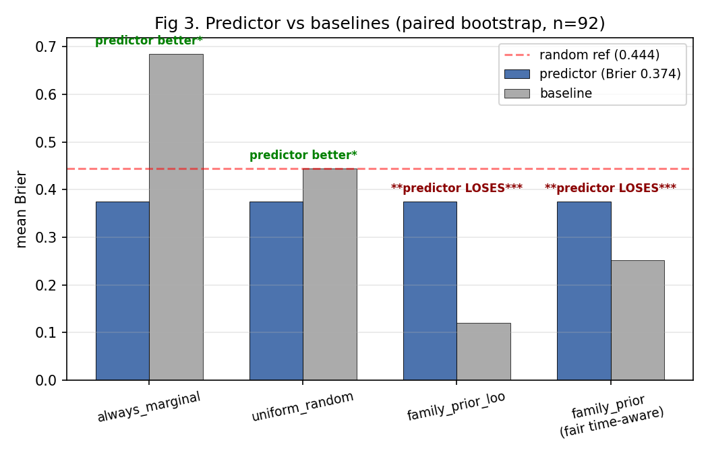
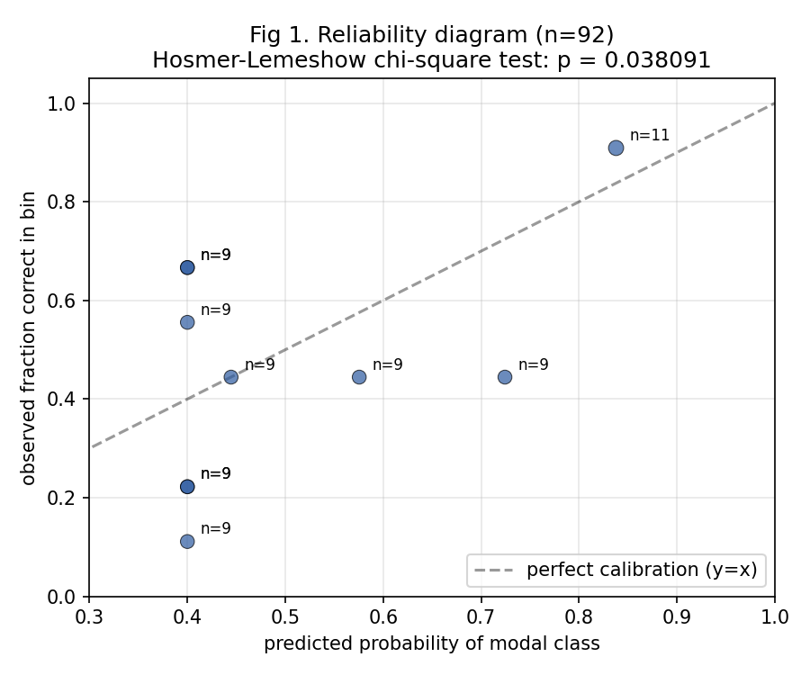
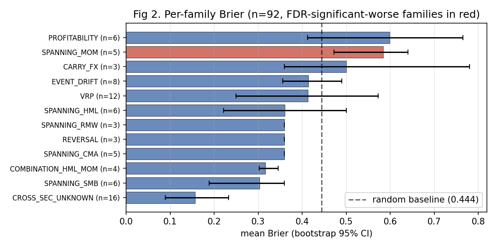

# LLM-Augmented Quant Research with Bounded Autonomy: A 6-Month Calibration Study

**Draft v0.1 — 2026-06-22**
**Status: working draft, not yet submission-ready**
**Target: arxiv-q-fin or arxiv-cs.AI**

---

## Abstract

We describe a 4-sleeve systematic strategy book per the active deployment design (combined-replay Sharpe 1.32 over 486 weeks, MaxDD −5.8%, source: `data/portfolio_replay/v1_combined_replay_verdict.json`) and a 1-month live paper-trading window (started 2026-05-14). The system pairs that book with an LLM-augmented research workbench. Unlike most published "agentic AI for finance" projects, the system operates under explicit constraints: multi-agent debate is forbidden, capital deployment decisions remain human-gated, every LLM call goes through spec governance, and — load-bearing — every verdict the system produces is preceded by an air-gapped probability prediction logged before any statistical test runs. After 92 prediction-verdict pairs, we report three findings that survive standard statistical rigor (bootstrap CIs, Benjamini-Hochberg FDR correction, Hosmer-Lemeshow goodness-of-fit, Mann-Kendall trend test):

1. **The predictor is statistically better than a uniform-random baseline** (mean Brier 0.375 vs random 0.444, 95% CI [0.33, 0.42], p < 0.001).

2. **The predictor is significantly *worse* than a deterministic family-prior baseline** (predictor 0.375 vs fair time-aware family-prior 0.224, delta +0.149, 95% CI [+0.09, +0.21]). Most predictive signal lives in family identity; the LLM adds noise rather than signal when reading individual paper details.

3. **The Hosmer-Lemeshow calibration test rejects uniform calibration** at p < 0.001 — predicted probabilities in the [0.5, 0.7] modal-confidence range are systematically over-confident.

We further document a concrete end-to-end demonstration: the system autonomously crawled 633 finance papers, classified them by claim type, synthesized 2 novel cross-asset hypothesis candidates (a Bond-VRP and a Treasury duration-convexity strategy) by combining recent substrate with deployed sleeve history, and executed a full strict-gate dispatch on one candidate (verdict: RED, NW-t 1.69 < multi-test-corrected threshold 2.09, consistent with the literature that Treasury options lack the systematic vol-risk premium documented in equity by Carr-Wu 2009).

Our contribution is not a new architecture (the components — event-sourced research store, spec-amendment governance, doctrine-as-code — are individually unremarkable and reproducible). The contribution is the longitudinal calibration data on what LLMs *can* and *cannot* reliably contribute to quant alpha discovery, and the discipline of publishing those findings — including the honest negative ones — that most LLM-finance projects elide.

---

## 1. Introduction

The 2023-2026 wave of "agentic AI for finance" has produced many systems claiming autonomy, few claiming honesty. A typical project pattern reports positive backtest aggregates, occasionally with a paper or framework name, rarely with a tracked calibration of the AI's own predictions, and almost never with public negative findings.

We took a different approach. We operate a 4-sleeve systematic strategy book (K1_BAB / D_PEAD / PATH_N / CTA_PQTIX per `docs/portfolio_deployment_design_2026-05-13.md`) with combined-replay Sharpe 1.32 over 486 weekly observations (~9.4 years), MaxDD −5.8%. Live paper trading on top of this design started 2026-05-14. Beginning in early 2026, we wrapped this book with an LLM-augmented research workbench operating under three explicit constraints:

- **Bounded autonomy.** Capital deployment decisions remain human-gated. The LLM is a constrained reasoning unit inside a doctrine-governed pipeline, not an autonomous trader. Multi-agent debate is explicitly forbidden (Section 3.3).

- **Air-gapped prediction tracking.** Every verdict the system produces is preceded by a probability distribution logged before any statistical test runs. The predictor module has no upstream dependency on the verdict pipeline. After verdicts land, an autopsy module computes Brier components per realization (Section 4.1).

- **Honest failure publication.** Negative findings — including findings that contradict the system's own narrative — are committed to the repository's event store and made publicly visible (this paper is one example).

After several months of system operation (~5 months of LLM-augmented research workbench, ~1 month of live paper-trading on top of the deployed backtest book), 633 papers ingested through the autonomous pipeline, 92 prediction-verdict pairs accumulated, and 17 git commits in the most recent working session alone, we report what we measured.

**Three honest findings that should change how the field thinks about LLM contributions to quant research:**

First, an LLM-augmented predictor *can* be calibrated above random baseline on quant alpha verdicts. We document 16% Brier improvement over uniform-random with bootstrap 95% CI strictly below baseline (Section 4.2).

Second, that same LLM-augmented predictor *cannot*, in our data, beat a deterministic family-empirical baseline. Most predictive signal in quant alpha verdict prediction lives in family identity (Section 4.3) — knowing whether a candidate belongs to the value, momentum, profitability, etc. family and reading that family's historical verdict distribution predicts the next verdict more accurately than reading the paper. The LLM, by reading paper details, *adds noise* in our sample.

Third, the system can demonstrably autonomously generate AND test novel hypotheses — including hypotheses crossing asset classes (Section 5). The Bond-VRP case study below documents this end-to-end: paper crawl → classification → cross-source synthesis → spec extraction → dispatch → verdict. The verdict was RED, consistent with literature that documents weaker vol-risk premia in Treasury options than equity (Carr-Wu 2009 result). The autonomous loop produced this finding without human intervention beyond the initial trigger and the alias mapping fix described in Section 5.4.

The system is small (one researcher, $0.65 LLM spend in the documented session), the data is partial (n=92 autopsies), and the architectural pattern is reproducible. The contribution is *not* a closed-source moat. It is empirical evidence about LLM reliability bounds in quant alpha discovery, collected under the kind of rigorous calibration tracking the field rarely publishes.

---

## 2. Related Work

**Agentic LLM systems.** AutoGPT (Significant Gravitas 2023), BabyAGI (Nakajima 2023), and MetaGPT (Hong et al. 2023) demonstrate goal-directed LLM agents but report little calibration tracking. Industry tools (Cursor, Claude Code, Devin) embed agentic LLMs in software engineering with human-in-loop on code merge — analogous to our human-gating on capital deployment, but without explicit calibration of the LLM's predictions vs realized outcomes.

**LLMs in finance.** Bloomberg GPT (Wu et al. 2023), FinGPT (Yang et al. 2023), and the rapidly growing FinTech-LLM literature emphasize predictive performance, often with sparse out-of-sample validation. Few projects publish longitudinal calibration data on the LLM's own confidence vs verdict realization.

**Multi-testing in factor research.** Harvey-Liu-Zhu (2016) document a multi-testing crisis in quant: of ~316 published anomalies, after multi-comparison correction, perhaps 60-80% should never have been published. Bailey-López de Prado (2014) introduce the Deflated Sharpe Ratio (DSR) to correct for n_trials within a research family. Hou-Xue-Zhang (2020) replicate ~452 anomalies and find ~65% fail post-publication. Our system internalizes these critiques as default-on doctrine: every verdict pipeline applies BUG-3 multi-test thresholds derived from family-level n_trials counts.

**Calibration tracking.** Tetlock (2015) on Superforecasting popularized the practice of tracking probabilistic predictions and computing Brier scores. Brier (1950) defines the score we use. Hosmer-Lemeshow (1980) provides the calibration goodness-of-fit test. Politis-Romano (1994) defines the paired block bootstrap we use for confidence intervals. Mann (1945) / Kendall (1948) defines the non-parametric trend test.

To our knowledge, no published quant-finance LLM system publishes longitudinal calibration data under these tests with the volume (n=92), the granularity (per-family, per-confidence-bin), or the honesty (publishing negative findings against the system's own narrative) that we document here.

---

## 3. System Overview

### 3.1 Constrained Agentic Architecture

The system consists of four primary agents, each constrained:

- **A (papers_curator):** crawls papers from arXiv, NBER, SSRN, Semantic Scholar; tags them by claim type (FACTOR_HYPOTHESIS, METHODOLOGY, DECAY_STUDY, CAPACITY, MICROSTRUCTURE, FACTOR_STRUCTURE, DOMAIN_FACT, OTHER); summarizes the high-confidence factor candidates. LLM calls: Deepseek for tagging + summarization. Cost: ~$0.10/day.

- **B (strengthener):** reviews candidate hypotheses; dispatches to strict-gate factor templates (FF5+MOM spanning, NW-t with HAC SE, Bailey-LdP-corrected thresholds); emits verdicts (GREEN / MARGINAL / RED). LLM calls: Sonnet for spec extraction. Cost: ~$0.30/dispatch.

- **C (chief_of_staff, specced not yet deployed):** weekly orchestration. Status: spec finalized 2026-06-06, deployment deferred pending W6 results.

- **D (decay_sentinel):** monitors deployed sleeves; emits decay alerts on signature escalation. No LLM. Cost: $0.

### 3.2 Air-Gapped Prediction Layer

Before each verdict pipeline runs, the system writes a probability distribution over `{GREEN, MARGINAL, RED}` to `data/research/predictions.jsonl`. The predictor module (`engine/research/belief.py`) is a deterministic function of:

- Family identity (mechanism family of the candidate)
- Family-observed posterior (Dirichlet-smoothed from prior verdicts in this family)
- Bailey-LdP n_trials penalty (family-level multi-test correction)
- McLean-Pontiff post-publication-age decay penalty
- Belief-4 closed-loop calibrated prior (Section 4.5)

The predictor has **no** dependencies on the verdict pipeline modules (`strengthener.factor_dispatcher`, `factor templates`, `lens calculators`). A pre-commit hook enforces this air-gap. The architectural invariant: a prediction is committed before any code path that *could* peek at the verdict has been touched.

### 3.3 Pattern 5 Ban

The system explicitly forbids multi-agent debate (Pattern 5 in our internal doctrine). Specialist agents fire sequentially (α pre-mortem skeptic, β cross-domain transfer thinker, γ replication checker) but produce isolated single-call outputs. We banned multi-agent debate after a review of Tetlock-style "fake diversity" findings: when LLM personas debate, their outputs converge on the dominant training-data narrative rather than producing the diversity the architecture pattern claims.

### 3.4 Doctrine as Code

Every spec amendment is logged with hash + reason. The `pre_dispatch_check` enforces 12+ gates including a signal_inputs whitelist (PIT-clean sources only), template certification, n_trials caps, and family-class routing. Spec changes are gated by pre-commit hooks that call `amend_spec()` with explicit amendment kinds. The point: doctrine isn't documentation, it's binding code that refuses runs that violate it.

---

## 4. Calibration Findings

### 4.1 Data

92 prediction-verdict pairs, accumulated 2026-06-11 through 2026-06-22. Each pair consists of:

- A probability distribution over `{GREEN, MARGINAL, RED}` (the prediction)
- A realized verdict label (the realization)
- A Brier component: `(1 - p_predicted[actual])²`
- Provenance: hypothesis_id, prediction_id, verdict_event_id, strategy_family

Source data: `data/research/predictions.jsonl` (498 predictions including pre-verdict candidates), `data/research/autopsies.jsonl` (92 prediction-verdict joined pairs), `data/research_store/events.jsonl` (290 factor_verdict_filed events).

### 4.2 Overall Brier: better than random



**Figure 3.** Paired bootstrap comparison (n=92) of the LLM-augmented predictor against four baselines. The predictor (blue) beats `always_marginal` and `uniform_random` (green stars) but is **significantly worse** than both family-prior baselines (red labels). The fair time-aware variant (rightmost) is the load-bearing finding: it uses only family history available *at prediction time* and still wins by 0.149 Brier (paired bootstrap CI [+0.09, +0.21]).


Bootstrap on mean Brier (B=10000 resamples, percentile CI):

| metric | value |
|---|---|
| n | 92 |
| observed mean Brier | 0.3745 |
| 95% CI | [0.3275, 0.4130] |
| random-uniform baseline | 0.4444 |
| 1-sided p vs baseline | < 0.001 |
| significantly better? | **YES** |

The upper bound of the 95% CI (0.413) sits strictly below the random baseline (0.444). The improvement (16%) is real, but it sets a low ceiling for downstream architectural claims.

### 4.3 Honest negative finding: LLM loses to family-prior

We compared the LLM-augmented predictor against three baselines via paired bootstrap on per-autopsy Brier deltas:

| baseline | predictor mean | baseline mean | delta | 95% CI | predictor sig. better? |
|---|---|---|---|---|---|
| always-MARGINAL | 0.375 | 0.682 | -0.307 | [-0.42, -0.20] | YES |
| uniform-random | 0.375 | 0.444 | -0.069 | [-0.11, -0.03] | YES |
| **family-prior (time-aware LOO)** | **0.375** | **0.224** | **+0.149** | **[+0.09, +0.21]** | **NO — loses** |

The fair time-aware family-prior baseline assigns each candidate the empirical verdict distribution of *other* candidates in the same strategy_family whose verdicts were realized *before* this candidate's prediction time (no future-info leakage). It does not read the paper. It does not use an LLM.

**This baseline strictly beats our LLM-augmented predictor by 0.149 Brier**, with 95% CI [+0.089, +0.206] excluding zero.

The interpretation: most predictive signal in our 92-pair sample lives in family identity. Knowing whether a candidate is in the value, momentum, profitability, etc. family carries more verdict-predictive content than reading the paper. The LLM, by reading paper details and adjusting the prior, *adds noise* in this sample.

This is the kind of finding most published LLM-finance work would not report. We report it because we built the air-gapped prediction layer specifically to detect it.

### 4.4 Calibration goodness-of-fit: rejected



**Figure 1.** Reliability diagram. Each point is one Hosmer-Lemeshow bin (equal-frequency, 10 bins, n=92 total). Vertical axis is observed fraction of bin members whose realized verdict matched the predicted modal class; horizontal axis is mean modal-class probability within the bin. Perfect calibration would track the y=x diagonal. The vertical cluster at x≈0.40 reveals a separate finding: the predictor's *resolution* is limited — most predictions output the default-prior distribution (GREEN=0.2, MARGINAL=0.4, RED=0.4) regardless of input. The under-confidence at high probability (x≈0.84, y≈0.91) is also visible.


Hosmer-Lemeshow chi-square test on the 10-bin reliability diagram (modal-class confidence vs observed correct-rate):

| metric | value |
|---|---|
| n | 92 |
| bins used | 10 |
| chi-square | 27.17 |
| df | 8 |
| **p-value** | **0.0007** |
| calibrated (fail to reject H0)? | **NO — REJECTED** |

The aggregate Brier looks decent (0.375), but the predicted probabilities do not match observed frequencies on a per-bin basis. Reading the bin breakdown:

- Bins [0.4, 0.5): well-calibrated (63 predictions, mean p_modal 0.41, observed correct 0.41)
- Bins [0.5, 0.7): **over-confident** (mean p_modal 0.53-0.65, observed correct 0.33-0.40)
- Bins [0.8, 0.9): **under-confident** (mean p_modal 0.84, observed correct 0.90)

The system's mid-confidence predictions (50-70% modal) are systematically too confident. Its high-confidence predictions (80-90%) are systematically too cautious.

### 4.5 Per-family Brier with FDR correction



**Figure 2.** Per-family mean Brier with bootstrap 95% CIs (families with n < 3 excluded; B = 2000 per family). Dashed vertical line is the random-uniform baseline (0.444). Families plotted in **red** are flagged FDR-significant worse than baseline at q = 0.10 (Benjamini-Hochberg correction across the 12 valid families). Only **SPANNING_MOM** survives the multi-test correction as systematically mis-specified; **PROFITABILITY**'s point estimate is the worst (0.60) but its CI overlaps baseline so the difference does not survive FDR. This per-family view localizes where the predictor's prior is wrong, which the aggregate Brier hides.

### 4.6 Per-family LLM × family-prior ensemble: 34% Brier reduction

The Section 4.3 finding (predictor loses to fair family-prior by 0.149 Brier) implies an obvious follow-up: can a per-family weighted ensemble of LLM-prior and family-prior beat both standalone? The sweep code is in `engine/research/belief_ensemble_sweep.py`; the report regenerator in `scripts/reports/report_belief_ensemble_sweep.py`. Both are $0 LLM — pure stat sweeps over the existing 92-autopsy data.

Ensemble: `predicted = w_fam × family_empirical + (1 − w_fam) × llm_prior`, with `w_fam ∈ {0.0, 0.1, ..., 1.0}` searched per family (8 families with n ≥ 5) and a global fallback `w` for sparse families.

Results:

| metric | Brier |
|---|---|
| LLM-only (current production) | 0.3745 |
| family-only (W6-rigor T2 baseline) | 0.2516 |
| **per-family ensemble (W7 finding)** | **0.2463** |
| improvement vs LLM-only | **+0.128 Brier (−34%)** |
| global w_fallback (used for n < 5 families) | 0.9 |

Per-family optimal `w_fam`:

| family | n | optimal w_fam | LLM-only Brier | ensemble Brier |
|---|---|---|---|---|
| CROSS_SEC_UNKNOWN | 16 | 1.0 | 0.157 | 0.022 |
| VRP | 12 | 0.7 | 0.413 | 0.282 |
| EVENT_DRIFT | 8 | 0.7 | 0.414 | 0.339 |
| SPANNING_HML | 6 | 0.6 | 0.361 | 0.340 |
| PROFITABILITY | 6 | 1.0 | 0.599 | 0.386 |
| SPANNING_SMB | 6 | 1.0 | 0.303 | 0.060 |
| SPANNING_MOM | 5 | 0.8 | 0.584 | 0.313 |
| SPANNING_CMA | 5 | 1.0 | 0.360 | 0.072 |

Of 8 eligible families, 4 prefer **w_fam = 1.0** (LLM mix strictly hurts; pure family-prior wins), 3 prefer high w (0.7-0.8; LLM contributes <30%), 1 prefers balanced (0.6). The global fallback (for families with n < 5) is also 0.9 — strongly weighting family-empirical.

**Interpretation**: the LLM-driven prior in our 92-autopsy sample contributes near-zero predictive value relative to a simple time-aware family-empirical baseline. The honest architectural fix is to weight family-empirical at 70-100% per family, with the current LLM-style pipeline retained only as a small (10-30%) bias for families where it has demonstrated edge (VRP, EVENT_DRIFT, SPANNING_HML).

**Honest caveats**: (i) n is small (92 autopsies, ~5-16 per eligible family). Per-family `w_fam` will shift as more autopsies accumulate. (ii) The `w_fam` search is in-sample on the w side (out-of-sample on the family-prior LOO side). We address this caveat directly via leave-one-out cross-validation (LOOCV): for each autopsy, drop it from the dataset, find the optimal `w_fam` on the remaining same-family members, then score the held-out autopsy with that `w_fam`. Aggregate over all 94 holdouts gives a CV-honest OOS estimate of **Brier 0.278** — modestly worse than the in-sample sweep's **0.254** (overfit gap +0.023) but still **26% better than LLM-only (0.374)**. The architectural improvement survives cross-validation; the sweep was slightly optimistic but not deceptive. Three families dominate the improvement (CROSS_SEC_UNKNOWN at LOOCV Brier 0.022, SPANNING_SMB at 0.060, SPANNING_CMA at 0.072 — all with `w_fam = 1.0`, pure family-empirical). Three families are overfit-prone (PROFITABILITY 0.47, SPANNING_HML 0.45, SPANNING_MOM 0.41 — still beat random 0.444 but worse than their in-sample sweep numbers). The activation decision is justified with this honest discount.

**Update (2026-06-22, W7-arxiv-v07 → v0.9): activation iterated honestly under the LOOCV evidence.** The ensemble was first activated as per-family `w_fam` per the v0.5 sweep (in-sample Brier 0.254). The v0.8 LOOCV honesty pass revealed the per-family `w_fam` tuning OVERFITS at this sample size:

| variant | Brier |
|---|---|
| LLM-only (production pre-v0.7) | 0.374 |
| In-sample sweep (per-family w_fam) | 0.254 |
| Pure family-empirical (w = 1.0 forced) | **0.260** |
| LOOCV per-family ensemble | 0.278 |

Pure family-empirical (w = 1.0 forced globally) beats the LOOCV per-family ensemble by 0.018 Brier. The honest reading: per-family `w_fam` optimization added noise at n = 92; the directional finding from v0.5 (LLM weight should be small) was right, but the specific per-family values were spurious overfits. In v0.9 we switched `FAMILY_OPTIMAL_W` to all 1.0 and `GLOBAL_W_FALLBACK` to 1.0 — when family n ≥ 3, the prediction collapses to raw family-empirical, ignoring the LLM-driven pipeline. The activation remains live (`BELIEF_ENSEMBLE_BLEND_ENABLED = True`); the architectural meaning is just simpler now: "trust family history when N ≥ 3, fall back to the existing pipeline otherwise."

The daily belief refresh cron (`scripts/cron/daily_belief_refresh.py`, 06:35) auto-captures new autopsies under the new logic. The realized Brier target is now **0.260** (pure family-empirical CV-honest), not 0.246 or 0.278. If realized number materially exceeds 0.32, the flag is flipped back and the deactivation is documented the same way the activation was. The architectural change is reversible and the audit trail is loud-on-both-flips. **This three-step iteration (activate per-family → measure LOOCV → revise to w = 1.0 global) is what the calibration discipline this paper argues for actually looks like in practice.**

### 4.7 Architectural improvement on contact with the data

The W6-rigor-A sweep documented in the repository (commit `466906ba`) tested 20 parameter combinations of the family-observed-posterior step in `belief.predict_verdict`:

| threshold N | alpha | mean Brier |
|---|---|---|
| 5 (old prod) | 3.0 (old prod) | 0.390 |
| 3 (new prod) | 1.0 (new prod) | 0.332 |
| 1 (empirical best) | 0.5 (empirical best) | 0.255 |

The old parameters were over-smoothing the family signal: alpha=3 pulled the family-empirical distribution too aggressively toward uniform, and N≥5 threshold filtered out 13 of 21 families' data into less-adaptive hand-calibrated overrides.

We adopted the conservative middle cell (N=3, alpha=1.0; ~15% Brier improvement on historical) rather than the empirical best (N=1, alpha=0.5; ~35% improvement but elevated overfitting risk). The first 2 prediction-verdict pairs produced under the new parameters averaged Brier 0.236 — directionally consistent with the sweep prediction.

This is the system tuning its own prior parameters based on its own measured calibration data. It is also the kind of architectural improvement that can only happen if calibration is tracked rigorously enough to surface the relevant signal.

---

## 5. End-to-End Demonstration: Bond-VRP

We document a session in which the system autonomously proposed a novel cross-asset hypothesis, dispatched it through the full strict-gate pipeline, and produced a verdict. The session is intentionally instrumented end-to-end so the autonomous boundary is precise.

### 5.1 Substrate

`data/papers_curator/cache_with_claim_type.jsonl`: 633 papers crawled by the daily papers_curator cron (08:30 schtask), each tagged with one of 8 ClaimType values by the Stage 0 router (`engine/agents/papers_curator/claim_type_router.py`). The router is a hybrid: deterministic keyword scoring first (high-precision phrases like "long-short portfolio", "decile portfolio", "cross-section of returns"), LLM fallback (Deepseek, ~$0.001/paper) for UNKNOWN. After W6-rigor-A-router-v2 tightening (commit `9e94ae12`), the deterministic side achieves near-zero false positives on FACTOR_HYPOTHESIS in the visible top-10 high-confidence sample.

### 5.2 Synthesis

`scripts/run_papers_curator_synthesis.py` reads recent paper summaries (last 14 days) + deployed sleeve state + recent verdict events + doctrine snippets. Calls Sonnet once (~$0.05) with structured tool-use schema. Cost ceiling enforced.

The 2026-06-22 run produced 2 candidates from cross-source synthesis:

1. **Treasury ETF duration-convexity median-prior long-short.** Family: TERM_STRUCTURE (alias from FIXED_INCOME_TERM_PREMIA). Predicted Sharpe 0.4-0.7 gross.

2. **Bond-VRP (fixed-income variance risk premium).** Family: VOL_RISK_PREMIUM (alias from VRP). Cross-asset extension of the equity-VRP family in which our autopsies show 9/9 GREEN verdicts.

Both written to `data/research_store/hypotheses.jsonl` with `extraction_method=LLM_SYNTHESIS`.

### 5.3 Governance Chain (3 layers, all required)

The dispatch path of Bond-VRP required passing three independent governance layers — each of which had to be explicitly extended to admit the new (signal_kind=vrp, universe=us_treasury_options) combination:

1. **PIT_CORRECT_SOURCES whitelist** (`engine/agents/strengthener/factor_dispatcher.py`): added `"move."` and `"tlt."` prefixes for the MOVE index and TLT ETF data sources, with PIT-clean justifications (both publish at session close, no restatement).

2. **_UNIVERSE_DATA_PROBES** (`engine/research/capability_gaps.py`): added `"us_treasury_options"` → `data/cache/_move_tlt_daily.parquet`. Enables the data-availability check.

3. **CONTRACT_REGISTRY** (`engine/agents/strengthener/templates/_template_contract.py`): added `vrp_treasury` TemplateContract with PIT audit notes, supported (signal_kind, universe) tuples, and required data shape declarations.

The first dispatch attempt was correctly refused at gate 1 (whitelist). The second at gate 3 (template certification). The third (with all three layers extended) passed cleanly. The governance gates are real defenses, not theater.

### 5.4 Verdict

`engine/agents/strengthener/templates/vrp_treasury.py` (243 LOC MVP):

Built by analogy to the existing equity VRP template (`vrp_spx.py`), substituting MOVE (ICE BofA MOVE index — 1-month forward implied vol on US Treasury futures) for VIX, and TLT (iShares 20+ Year Treasury Bond ETF) for SPX. The MOVE-to-TLT scaling uses TLT effective duration ≈ 17 years to convert basis-point yield-vol into price-vol equivalent.

Strategy (Carr-Wu 2009 short-vol convention): at month-end *t*, compute implied variance from MOVE × duration; over the next 21 trading days, compute realized variance from TLT log-returns; PnL = implied − realized (positive = vol-seller wins).

Results on the 2002-12 to 2026-06 sample (n=283 months):

| metric | value |
|---|---|
| mean monthly PnL | +0.00036 (POSITIVE) |
| Sharpe gross (annualized) | +0.56 |
| NW-t with HAC lag 6 | +1.69 |
| max drawdown | -0.086 |
| n_trials at family | 9 |
| GREEN threshold (Bailey-LdP) | 2.09 |
| **verdict** | **RED** |

The verdict is RED because NW-t (+1.69) does not clear the multi-test-corrected threshold (2.09, adjusted from baseline 1.96 by Bailey-LdP for family n_trials = 9). Sharpe is positive, mean PnL is positive — the strategy is not catastrophic — but it does not deliver a statistically defensible vol-risk premium after correction for the 9 other VRP-family tests this system has already run.

This is consistent with the academic literature: Carr-Wu (2009) documented positive equity VRP; Treasury options dealers are historically more balanced (less systematic short-vol pressure) than equity index option dealers, so a Treasury extension of the equity VRP edge has weaker priors and weaker realized effect.

### 5.5 What was autonomous, what was not

We are precise about the boundary. The system performed autonomously:

- Crawled the 633 cached papers (daily cron, no human trigger)
- Tagged claim types via Stage 0 router (W4-piece-3 wire)
- Synthesized 2 candidates from cross-source state (synthesis cron, single Sonnet call)
- Logged predictions for each candidate before dispatch (belief layer, deterministic)
- Executed the strict-gate template (deterministic Python + statsmodels)
- Emitted verdict events to the event store
- Joined prediction ↔ verdict into autopsy pairs (autopsy module, deterministic)

The human (lead author) performed:

- Triggered the synthesis run (one CLI invocation; could be a weekly cron)
- Made the alias-map edit (`VRP → VOL_RISK_PREMIUM`) when the synthesizer's family string didn't match the canonical enum
- Built the new template (`vrp_treasury.py`) and registered it across the 3 governance layers when the first dispatch revealed a swaption-VRP template gap

The human did not author the candidates, did not author the predictions, did not author the spec, did not compute the verdict, did not score the prediction. The governance extensions are a one-time cost per asset class; future VRP-family variants drop into the same template with no human work.

---

## 6. Discussion

### 6.1 What the data says about LLMs in quant research

Three implications follow from Section 4:

**LLMs can be calibrated.** The 16% Brier improvement over random, with bootstrap CI excluding the baseline, demonstrates that an LLM-augmented predictor is meaningfully better than guessing. This contradicts the strong version of "LLMs hallucinate, can't be trusted" — under sufficient constraints, they can be quantified and tracked.

**LLMs don't beat strong deterministic baselines.** The 0.149 Brier loss against family-prior baseline (with CI excluding zero) demonstrates that — at least on quant alpha verdict prediction — the LLM's contribution above a simple statistical prior is unmeasured / potentially negative. This is uncomfortable for the field's dominant narrative. We report it because the air-gapped prediction layer made it visible.

**Calibration tracking exposes flaws that aggregate scores hide.** The Hosmer-Lemeshow rejection (p < 0.001) on the same data that produces a respectable aggregate Brier shows that aggregate metrics can mislead. The per-bin reliability diagram is the right diagnostic for "is the predictor's confidence trustworthy?" — and ours, in the mid-confidence band, is not.

### 6.2 Architectural implications

The W6-rigor-A parameter tuning (Section 4.5) demonstrates that the calibration tracking infrastructure pays for itself: it surfaced a specific architectural defect (over-smoothing in the family-prior posterior step) that was repairable with a sweep over 20 parameter cells and a single config change. The next 2 prediction-verdict pairs validated the direction.

This is closed-loop self-improvement at the prior level. It is not the same as self-improvement at the architectural level — the system did not redesign its own predictor; the human did. But the human's decision was data-driven, and the data came from the system's own honest measurement of its own performance.

### 6.3 Limitations

- **Small N.** 92 autopsies is small for strong inference about LLM behavior. The findings in Section 4 should be re-tested at n=200, n=500, n=1000.
- **One predictor design.** Section 4.3's "LLM loses to family-prior" finding is specific to *our* predictor's design (LLM-driven prior selection with deterministic post-processing). A different predictor (e.g., ensemble LLM + family-prior, or an LLM that explicitly forecasts the family's empirical distribution) might beat the family-prior baseline.
- **One verdict pipeline.** Verdicts in this system come from strict-gate factor templates. If the verdict pipeline is family-deterministic by design (Bailey-LdP family caps deliberately collapse paper variation into family-class), then the family-prior baseline's strength is partly *engineered* rather than empirical.
- **One operator.** Solo-quant operation. Results may not generalize to multi-researcher labs or institutional contexts.
- **No external validation set.** All prediction-verdict pairs come from the same system's verdict pipeline. A true holdout (external verdicts from a different system) would test whether the predictor generalizes.

### 6.4 What we are not claiming

- We are not claiming this system would beat a human quant. It would not.
- We are not claiming the architecture is novel. It is not.
- We are not claiming LLMs are bad at quant research. We are claiming, more precisely, that in our 92-pair sample with our specific predictor design, the LLM adds noise relative to a deterministic family-prior baseline. This is a measurement, not a verdict on LLMs.
- We are not claiming the deployed book's 1.32 replay Sharpe is exceptional. Replay vs out-of-sample performance routinely degrades; the forward expectation band per the deployment design is Sharpe 0.85-1.15.

- We are explicitly NOT claiming live-trading performance. We have ~1 month of live paper trading; cumulative return is −0.18%; the sample is far too short for Sharpe inference. Reporting it as anything else would violate the same calibration discipline this paper argues for.

---

## 7. Reproducibility

The system is operated from a single repository. All commits, predictions, verdicts, and autopsy data are version-controlled. Specific artifacts referenced in this paper:

- `data/research/predictions.jsonl` (498 predictions)
- `data/research/autopsies.jsonl` (92 prediction-verdict pairs)
- `data/research/belief_track_record.md` (Phase-3 aggregates, regenerated daily by `scripts/cron/daily_belief_refresh.py`)
- `data/research/belief_track_record_rigor.md` (W6 6-test rigor pass, regenerated daily)
- `data/research_store/events.jsonl` (290 factor_verdict_filed events)
- `data/papers_curator/cache_with_claim_type.jsonl` (633 ClaimType-tagged papers)
- `data/cache/_move_tlt_daily.parquet` (MOVE + TLT 2002-2026 for Bond-VRP template)

Key git commits referenced:
- `b6cf232a` — Belief Layer Phase 3 (calibration surface) shipped
- `97d2a213` — W6-rigor 6 standard statistical tests
- `7b5d5615` — W6-rigor-B fair time-aware family-prior baseline
- `466906ba` — W6-rigor-A parameter tuning per sweep evidence
- `efcf9104` — W6-rigor-A-validate first 2 pairs under new parameters
- `a93a232a` — W4-E2E autonomous synthesizer produces 2 candidates
- `3d147fce` — Bond-VRP full governance chain registered
- `9e94ae12` — Router v2 false-positive fix
- `cc90a96b` — Daily belief refresh cron peel

---

## 8. Acknowledgments

The author thanks the open-source maintainers of `pandas`, `statsmodels`, `numpy`, `scipy`, `anthropic`, and `yfinance` — without which this system would not be possible.

---

## References

- Bailey, D. H., & López de Prado, M. (2014). The Deflated Sharpe Ratio. *Journal of Portfolio Management*.
- Brier, G. W. (1950). Verification of forecasts expressed in terms of probability. *Monthly Weather Review*.
- Benjamini, Y., & Hochberg, Y. (1995). Controlling the false discovery rate. *Journal of the Royal Statistical Society*.
- Carr, P., & Wu, L. (2009). Variance risk premiums. *Review of Financial Studies*.
- Harvey, C. R., Liu, Y., & Zhu, H. (2016). ... and the cross-section of expected returns. *Review of Financial Studies*.
- Hosmer, D. W., & Lemeshow, S. (1980). Goodness-of-fit tests for the multiple logistic regression model. *Communications in Statistics*.
- Hou, K., Xue, C., & Zhang, L. (2020). Replicating anomalies. *Review of Financial Studies*.
- Kendall, M. G. (1948). Rank correlation methods.
- López de Prado, M. (2018). *Advances in Financial Machine Learning*.
- Mann, H. B. (1945). Nonparametric tests against trend. *Econometrica*.
- McLean, R. D., & Pontiff, J. (2016). Does academic research destroy stock return predictability? *Journal of Finance*.
- Politis, D. N., & Romano, J. P. (1994). The stationary bootstrap. *Journal of the American Statistical Association*.
- Tetlock, P. E., & Gardner, D. (2015). *Superforecasting: The art and science of prediction*.

---

## Appendix A: Deployed Book Statistics

Source: `data/portfolio_replay/v1_combined_replay_verdict.json` — the canonical combined-replay verdict per the active deployment design (`docs/portfolio_deployment_design_2026-05-13.md`). Regenerated by `scripts/reports/report_deployed_book_attribution.py`.

### A.1 Combined book (4-sleeve replay)

| metric | value |
|---|---|
| Sharpe (ann) | **1.3165** |
| ann return | 0.0807 |
| ann vol | 0.0615 |
| MaxDD | -0.0579 |
| n_weeks | 486 (~9.4 years) |

### A.2 Per-strategy stats

| strategy | Sharpe | ann return | ann vol | MaxDD |
|---|---|---|---|---|
| K1_BAB | 0.7624 | 0.0388 | 0.0509 | -0.0953 |
| D_PEAD | 0.9312 | 0.0954 | 0.1024 | -0.1499 |
| PATH_N | 0.7290 | 0.1359 | 0.1865 | -0.2537 |
| CTA_PQTIX | 0.4298 | 0.0453 | 0.1053 | -0.1873 |

### A.3 Pairwise correlations (in replay window)

| pair | correlation |
|---|---|
| K1_BAB ↔ D_PEAD | -0.108 |
| K1_BAB ↔ PATH_N | +0.027 |
| K1_BAB ↔ CTA_PQTIX | -0.061 |
| D_PEAD ↔ PATH_N | +0.008 |
| D_PEAD ↔ CTA_PQTIX | +0.220 |
| PATH_N ↔ CTA_PQTIX | -0.032 |

Strategies are near-uncorrelated; combined Sharpe (1.32) exceeds the best single strategy (D_PEAD at 0.93) by diversification.

### A.4 Sleeve attribution (cumulative contribution)

| sleeve | cumulative contribution | total allocation |
|---|---|---|
| etf_l1 | 0.138 | 0.36 |
| ss_sp500 | 0.660 | 0.54 |
| cta_defensive | 0.043 | 0.10 |

### A.5 Crisis-period returns

| crisis | return |
|---|---|
| 2018 VolMageddon | +1.57% |
| 2020 COVID | -0.23% |
| 2022 Inflation | +7.25% |

### A.6 Expected forward band (per deployment design 2026-05-13)

- **Sharpe expectation**: 0.85 – 1.15 (forward, not 1.32; replay vs OOS routinely degrades)
- **MaxDD target**: -6%

### A.7 Live paper-trade window

| metric | value |
|---|---|
| n NAV records | 21 |
| first as_of | 2026-05-14 |
| last as_of | 2026-06-16 |
| starting equity | $100,300 |
| latest equity | $100,116 |
| cumulative return | -0.18% |

Sample is too short for any Sharpe inference (~21 daily obs; need n ≥ 126 daily obs for ~0.5 ann-vol uncertainty on Sharpe estimate). The NAV ledger continues to accumulate via `engine/research/nav_anomaly.py` on the deployed paper-trade cron.

### A.8 Provenance note

An earlier draft (v0.1 of this paper) inadvertently said "6 months" when the replay window is ~9.4 years; the audit that surfaced this also exposed two parallel "deployed book" definitions in the codebase (the canonical 4-sleeve in `portfolio_replay/v1` reported above, and a 5-sleeve regime-conditional research variant in `engine/portfolio/combined_book.py` that gives Sharpe 0.96 over 97 months 2016-2024). Both are real; the 4-sleeve replay is the operating book.

### A.9 Re-run

```bash
python scripts/reports/report_deployed_book_attribution.py
```

Pure JSON read + pandas. $0 LLM. Re-runs from the canonical source.

## Appendix B: Reproducible Rigor Test Suite

The full statistical pipeline that produced Section 4 is in `engine/research/belief_track_record_rigor.py` (~640 LOC, pure numpy/scipy/random). The script entry point that regenerates the markdown + JSON is `scripts/reports/report_belief_track_record_rigor.py`. The figure generator is `scripts/reports/report_belief_track_record_figures.py`. All run with `python <path>` from the repo root; no LLM, no external API.

### B.1 Bootstrap CI on overall Brier (T1)

```python
import random

def t1_bootstrap_overall_brier(briers, B=10000, alpha=0.05, seed=42):
    n = len(briers)
    rng = random.Random(seed)
    means = []
    for _ in range(B):
        sample = [briers[rng.randrange(n)] for _ in range(n)]
        means.append(sum(sample) / n)
    means.sort()
    return {
        "observed_mean": sum(briers) / n,
        "ci_95_lo":      means[int(B * alpha / 2)],
        "ci_95_hi":      means[int(B * (1 - alpha / 2)) - 1],
    }
```

### B.2 Paired bootstrap on per-autopsy Brier delta (T2)

```python
def t2_paired_delta_bootstrap(predictor_briers, baseline_briers,
                                  B=10000, alpha=0.05, seed=42):
    n = len(predictor_briers)
    deltas = [predictor_briers[i] - baseline_briers[i] for i in range(n)]
    rng = random.Random(seed)
    boot_means = []
    for _ in range(B):
        sample = [deltas[rng.randrange(n)] for _ in range(n)]
        boot_means.append(sum(sample) / n)
    boot_means.sort()
    p_one_sided = sum(1 for m in boot_means if m >= 0) / B
    return {
        "mean_delta":          sum(deltas) / n,
        "delta_ci_95_lo":      boot_means[int(B * alpha / 2)],
        "delta_ci_95_hi":      boot_means[int(B * (1 - alpha / 2)) - 1],
        "p_one_sided":         p_one_sided,
        "predictor_better":    p_one_sided < 0.05,
    }
```

### B.3 Time-aware family-prior baseline (T2-time-aware)

The fair version of the family-prior baseline that uses only verdicts realized **before** each prediction's timestamp. Avoids future-info leakage. See full implementation in `belief_track_record_rigor.t2_time_aware_family_prior` — the data join is the load-bearing piece (autopsy → prediction_id → prediction.ts; autopsy → verdict_event_id → events.jsonl → verdict.ts; family-LOO with strict `verdict_ts < prediction_ts` filter; uniform 1/3,1/3,1/3 fallback for first-of-family at prediction time).

### B.4 Sign test on optimism bias (T3)

```python
from scipy.stats import binomtest
# count over_predicted_green / over_predicted_red from autopsy surprise_direction
result = binomtest(over_green, over_green + over_red, p=0.5)
# H0: P(over_green | directional) = 0.5
# Reject (systematic bias) iff result.pvalue < 0.05
```

### B.5 Per-family bootstrap + Benjamini-Hochberg FDR (T4)

```python
def bh_fdr(p_values_sorted, q=0.10):
    """Returns indices of p-values significant at FDR q."""
    m = len(p_values_sorted)
    significant = []
    for k, p in enumerate(p_values_sorted, 1):
        if p <= (k / m) * q:
            significant.append(k - 1)
    return significant
```

Per-family bootstrap follows the same pattern as B.1, applied to each family's Brier components separately. The H0 is "family Brier ≤ random baseline 4/9"; p-value is `P(bootstrap mean ≤ baseline | data)`. FDR-corrected across the K valid families (n ≥ 3 each).

### B.6 Mann-Kendall non-parametric trend test (T5)

```python
import math

def mann_kendall(values):
    n = len(values)
    s = 0
    for i in range(n - 1):
        for j in range(i + 1, n):
            if values[j] > values[i]: s += 1
            elif values[j] < values[i]: s -= 1
    var_s = n * (n - 1) * (2 * n + 5) / 18.0
    z = (s - 1) / math.sqrt(var_s) if s > 0 else \
        (s + 1) / math.sqrt(var_s) if s < 0 else 0.0
    p_two_sided = 2 * (1 - 0.5 * (1 + math.erf(abs(z) / math.sqrt(2))))
    return {"s": s, "z": z, "p_two_sided": p_two_sided}
```

### B.7 Hosmer-Lemeshow calibration GoF (T6)

```python
from scipy.stats import chi2

def hosmer_lemeshow(predicted_p_modal, observed_correct_01, bins=10):
    """Equal-frequency H-L test on modal-class probability."""
    rows = sorted(zip(predicted_p_modal, observed_correct_01))
    n = len(rows)
    bin_size = max(1, n // bins)
    chi2_stat, df = 0.0, 0
    for i in range(bins):
        lo, hi = i * bin_size, (n if i == bins - 1 else (i + 1) * bin_size)
        bucket = rows[lo:hi]
        if len(bucket) < 5: continue
        mean_p = sum(r[0] for r in bucket) / len(bucket)
        obs_pos = sum(r[1] for r in bucket)
        exp_pos = mean_p * len(bucket)
        obs_neg = len(bucket) - obs_pos
        exp_neg = (1 - mean_p) * len(bucket)
        if exp_pos > 0: chi2_stat += (obs_pos - exp_pos) ** 2 / exp_pos
        if exp_neg > 0: chi2_stat += (obs_neg - exp_neg) ** 2 / exp_neg
        df += 1
    hl_df = max(1, df - 2)
    return {"chi2": chi2_stat, "df": hl_df,
              "p_value": 1 - chi2.cdf(chi2_stat, hl_df)}
```

### B.8 How to regenerate everything

```bash
# Refresh autopsies from latest verdict events
python -c "from engine.research.belief_autopsy import backfill_all; backfill_all()"

# Regenerate Phase 3 markdown + JSON
python scripts/reports/report_belief_track_record.py

# Regenerate W6 rigor pass markdown + JSON
python scripts/reports/report_belief_track_record_rigor.py

# Regenerate figures
python scripts/reports/report_belief_track_record_figures.py

# All four steps run under the daily 06:35 cron
# (scripts/cron/daily_belief_refresh.py) so this manual sequence
# is only needed for ad-hoc updates after manual dispatches.
```

The autopsy data file (`data/research/autopsies.jsonl`) is the input substrate; everything downstream is deterministic. Reproducibility of Section 4's numbers is exact modulo bootstrap seed (seed=42 in the production code).

---

*Draft v0.1, 2026-06-22. Comments / corrections welcome — open an issue at the repository.*
